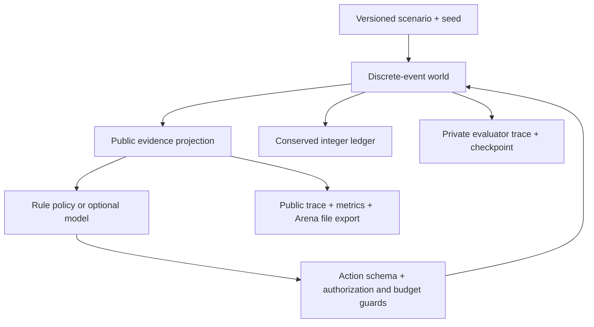

# Arena Execution Bench

[](https://github.com/sunruize93-cmyk/arena-execution-bench/actions/workflows/ci.yml)
[中文说明](README.zh-CN.md) · [Semantics](docs/SEMANTICS.md) · [Reproduction](docs/EXPERIMENTS.md)

**Can an agent make good purchasing decisions when payment is uncertain and reserved money cannot be reused?**

AEB is an offline, deterministic execution market. Buyer agents choose among synthetic providers, reserve a budget, and handle delayed confirmations, failures, refunds, and deadlines. It runs on a CPU with Python 3.10+, without a database, wallet, chain node, GPU, or model key.

Version 0.1.0 implements the research environment and local mechanism checks. Results are synthetic and exploratory. No paid LLM pilot, real-provider evaluation, or production Arena integration is claimed.

## Start in one minute

```bash
git clone https://github.com/sunruize93-cmyk/arena-execution-bench.git
cd arena-execution-bench
python3 -m venv .venv
source .venv/bin/activate
python -m pip install -e '.[dev]'

aeb run --suite mechanism-v1 --policy expected-cost --seed 7 --out runs/first
aeb replay --trace runs/first/episodes/late-unknown-dev--seed-7/events.jsonl
aeb verify --episode runs/first/episodes/late-unknown-dev--seed-7
python examples/no_key_demo.py
```

On Windows, activate with `.venv\Scripts\Activate.ps1`. The simulator is portable; the optional process adapter currently targets POSIX systems for process-group termination. PyPI publication is not required; install from this repository or a built wheel.

## The first experiment

Keep prices, jobs, actual confirmation times and random draws identical. Change the observed submission label from `submitted` to `submission_unknown`. A deliberately unsafe `naive-retry` policy issues a fresh authorization on unknown status.

| Observation | Track | Utility, seed 7 | Duplicate payments |
| --- | --- | ---: | ---: |
| Known submission | Guarded | 380 | 0 |
| Unknown submission | Guarded | 380 | 0 |
| Known submission | Diagnostic | 380 | 0 |
| Unknown submission | Diagnostic | -1540 | 6 |

The unsafe rule keeps retrying while any unknown attempt remains, including after another attempt has delivered. This fixture verifies the consequence of that bug; it is not a measurement of LLM behavior. Both tracks always enforce nonnegative cash balances. Diagnostic relaxes only the new-authorization guard, inside the simulator.

Reproduce the table with `python examples/no_key_demo.py`. See [the experiment definitions](docs/EXPERIMENTS.md) and [checked development results](artifacts/mechanism-v1/README.md).

## Included

| Component | v0.1 behavior |
| --- | --- |
| Engine | Integer double-entry cash accounts, stable event queue, virtual time, fixed drain horizon |
| State | Separate hidden settlement and public evidence; unknown is distinct from failed |
| Contracts | Validated observations/actions/scenarios, packaged schema with a SHA-256 lock |
| Scenarios | Risk threshold, late confirmation, liquidity, mixed procurement; 8 conditions in each of train/dev/eval |
| Policies | Cheapest, fastest, expected utility, Bayesian posterior mean, Thompson sampling, budget-aware threshold, unsafe retry fixture |
| Exact reference | Finite-horizon DP for one public, immediate-outcome job; unsupported worlds are rejected |
| Evaluation | Net utility, on-time delivery, duplicate/budget requests and effects, fees, lock duration, recovery, censoring, tails |
| Reproduction | Saved observations/actions, public/evaluator traces, checkpoints, deterministic replay, episode-level bootstrap |
| Model adapter | Optional JSON process interface, HTTPS Chat Completions example, explicit dispatch caps and failure accounting |
| Arena handoff | Allowlisted file export marked synthetic, with production ranking eligibility disabled |

The action vocabulary is `select`, `wait`, `query`, `reject`, and `retry`. Retry explicitly distinguishes `rebroadcast` from `new_authorization`. One batch is requested per decision epoch. Invalid input consumes an epoch and produces a rejection event.

## Compare policies

```bash
aeb run --policy cheapest --seeds 0,1,2,3,4,5 --out runs/cheap
aeb run --policy expected-cost --seeds 0,1,2,3,4,5 --out runs/expected
aeb compare --runs runs/cheap runs/expected --paired-by seed --out runs/comparison
python scripts/reproduce.py --out runs/reproduction
```

Comparisons pair independent episodes by scenario and seed, never individual jobs. They reject missing pairs, changed scenarios, incompatible engines and model runs stopped by dispatch caps. Explicit flags permit mechanism or track comparisons. The signed baseline utility gap is not a clairvoyant oracle regret.

## How it fits together



Arena402 is an optional replay host. This repository does not contain Arena identity, wallets, Runtime, Connector, admin pages, or a second product frontend. Arena-owned APIs must ingest and project the public file before serving it to the website.

## Extend or inspect

- [Economic and execution semantics](docs/SEMANTICS.md): fees, utility, public evidence, and censoring.
- [Experiment protocol](docs/EXPERIMENTS.md): thresholds, causal pairs, splits, and statistical scope.
- [Agent interface](docs/AGENTS.md): implement an adapter and control calls, tokens, time, and estimated spend.
- [Arena export and contract status](docs/INTEGRATION.md): public handoff, provisional schema, upstream migration.
- [Contributing](CONTRIBUTING.md) and [security boundaries](SECURITY.md).

```bash
pytest -q
ruff check src tests scripts examples
python scripts/check_docs.py
python -m build
```

The standalone wheel bundles all scenarios and the schema. To create a custom scenario, copy a JSON file from [the scenario directory](src/aeb/data/scenarios), change the declared parameters, and pass its path through `aeb run --scenario`. The owned generator is [generate_assets.py](scripts/generate_assets.py).

## Research and protocol boundaries

[Magentic Marketplace](https://github.com/microsoft/multi-agent-marketplace) already provides an environment for studying agentic markets and economic outcomes. AEB isolates payment-state uncertainty and liquidity with a smaller, controlled simulator. Whether these mechanisms justify a distinct research benchmark remains an empirical question; this release makes no first-of-its-kind claim.

No released execution-lab schema was available for this implementation. AEB therefore labels its schema `aeb-provisional-0.1`; it does not claim x402 or upstream Lab conformance. Buyer-paid execution fees are a synthetic contract, not a statement about vanilla x402 payment paths. The only supported fee payer in v0.1 is the buyer, with submission-charged or success-charged fees.

Code, original synthetic scenarios, and golden traces are [Apache-2.0](LICENSE). See [NOTICE](NOTICE) for provenance and [CITATION.cff](CITATION.cff) for software citation metadata.
